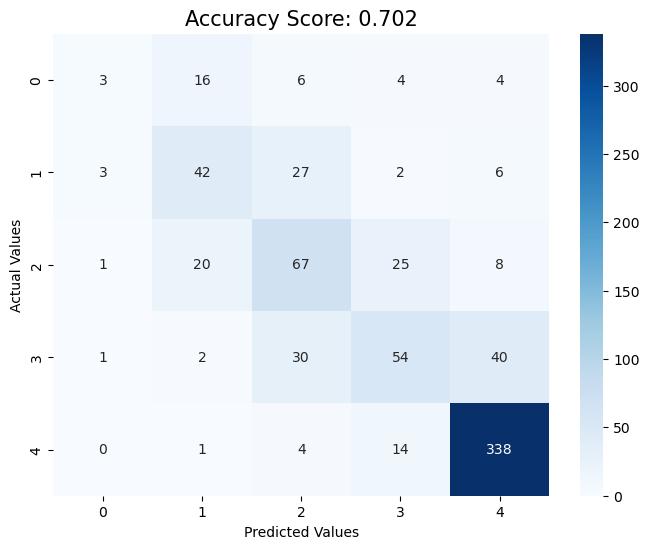

# Final Project
# Student Peformance Data

## NON-TECHNICAL EXPLANATION OF YOUR PROJECT
This project aims to analyze and predict high school students' academic performance using machine learning. By studying data on demographics, study habits, parental involvement, and extracurricular activities, the model identifies patterns that affect students' grades. The goal is to help educators and policymakers better understand the factors that contribute to student success, offering insights to improve academic support and intervention strategies. This approach provides a data-driven perspective on how different variables influence performance, enabling more effective resource allocation and personalized teaching strategies to enhance students' educational outcomes.

## DATA
This synthetically generated dataset contains comprehensive information on 2,392 high school students, including demographics, study habits, parental involvement, extracurricular activities, and academic performance. The dataset's target variable, "GradeClass," classifies students' grades into distinct categories, allowing for robust educational research, predictive modeling, and statistical analysis. It is provided by Rabie El Kharoua under the CC BY 4.0 license and was created for educational purposes. 

## MODEL 
The project uses a Random Forest Classifier to predict student performance based on demographic information, study habits, parental involvement, and extracurricular activities. A Random Forest is an ensemble learning method that builds multiple decision trees and combines their results to improve predictive accuracy and generalization.

Why it was chosen:
- Non-Linear Modeling: Student performance is influenced by a mix of factors, many of which interact in complex, non-linear ways. Random Forest can capture these relationships better than linear models.

- Overfitting Prevention: While individual decision trees are prone to overfitting, Random Forest reduces this risk by averaging predictions across many trees, making the model more robust.

- Feature Importance: This model provides insight into which factors (e.g., parental involvement, study habits) have the most influence on students’ grades, aiding in interpretability.

- Versatility: It works well with both categorical and numerical features without requiring extensive preprocessing, making it an efficient and flexible choice for this dataset.

- Scalability: Random Forest scales well to large datasets, making it ideal for projects involving thousands of students.

## HYPERPARAMETER OPTIMSATION
In the Random Forest model, several hyperparameters were optimized to improve the model's performance:

- n_estimators: The number of trees in the forest. A higher number generally improves performance, but it also increases computational time.
- max_depth: Controls the maximum depth of each tree. Deeper trees capture more complexity but can lead to overfitting. This parameter was tuned to balance the model’s ability to learn while preventing overfitting.
- min_samples_split: The minimum number of samples required to split a node. Increasing this can prevent the model from creating overly complex trees that fit the training data too closely.
- max_features: Limits the number of features considered at each split, ensuring diversity among trees and reducing overfitting risk.

Hyperparameters were optimized using RandomizedSearchCV, which efficiently searches through a defined range of values and evaluates each configuration using cross-validation. This approach balances exploration of the hyperparameter space with computational cost.

## RESULTS
- Accuracy: The final model achieved an accuracy of 70.2%, which indicates that it correctly predicted the student grade class 7 out of 10 times.
- Confusion Matrix: A heatmap of the confusion matrix (shown in the screenshot below) reveals how well the model predicted each class, highlighting areas where the model performs well and where it struggles.

Key takeaways:

- **Most Important Features:** Features like Absences, StudyTimeWeekly, and ParentalSupport were the most influential in predicting a student’s grade class. This suggests that attendance and support from parents have a strong impact on student performance.
- **Model Bias:** The model seems to predict higher-performing students better than lower-performing ones, which might indicate class imbalance.

While the model is reasonably accurate, there’s still room for improvement, such as adjusting for class imbalance or exploring more advanced techniques like XGBoost for comparison.

## CONTACT DETAILS:
EMAIL: akilaambady@yahoo.co.uk
